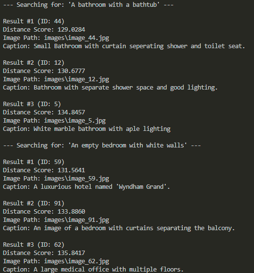
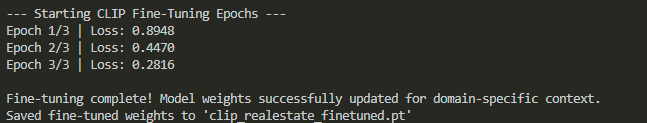
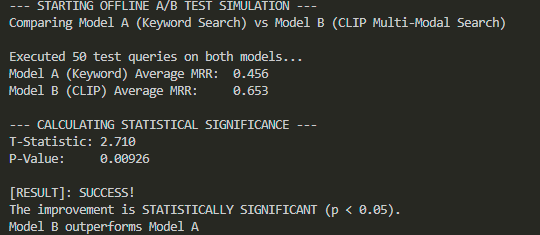

# Prop-Vision-AI: Multi-Modal Real Estate Search Engine

## Project Overview
Prop-Vision-AI is an end-to-end, production-grade Multi-Modal Generative AI search engine built for the real estate domain. It allows users to query property listings using natural language and semantic concepts rather than traditional hard-coded filters (e.g., searching for "A modern bathroom with marble countertops" instead of clicking "Bathrooms: 1"). 

This project demonstrates a complete ML lifecycle: data ingestion, vision-language embedding extraction, domain-specific model fine-tuning with PyTorch, high-speed vector retrieval, a production FastAPI backend, an interactive Streamlit frontend, and offline statistical evaluation.

## Tech Stack
* Deep Learning / Multi-Modal: OpenAI CLIP (ViT-B-32), PyTorch, Hugging Face
* Vector Database: ChromaDB
* Backend & API: FastAPI, Uvicorn, Pydantic
* Frontend UI: Streamlit, Requests
* Evaluation & Statistics: Scikit-learn, SciPy, NumPy
* Data Processing: Pandas, Pillow (PIL)

## System Architecture & Pipeline

1. Data Ingestion (data_prep.py): 
   Pulls a sample dataset (jashu66/realestate-image-dataset) from Hugging Face containing interior/exterior property images and corresponding natural language captions, organizing them locally.
2. Model Fine-Tuning (fine_tune.py): 
   Implements a custom PyTorch training loop utilizing Contrastive Loss (Symmetric Cross-Entropy) to update the vision-language model weights for real estate-specific context, saving state dictionaries to `clip_realestate_finetuned.pt`.
3. Vectorization & Indexing (build_index.py): 
   Passes images through the fine-tuned CLIP model, extracts domain-adapted dense vector embeddings, and stores them in a local ChromaDB instance for low-latency similarity search.
4. Backend REST API (app.py): 
   Asynchronously wraps the retrieval logic using FastAPI and Pydantic, loading the fine-tuned weights on startup to serve secure JSON endpoints (`/search`) to downstream clients.
5. Frontend Microservice (ui.py): 
   A decoupled Streamlit user interface that consumes the FastAPI backend, allowing non-technical users to execute semantic searches and view side-by-side visual results.
6. Offline A/B Test Simulation (ab_test.py): 
   Evaluates theoretical business impact by comparing the Mean Reciprocal Rank (MRR) of the Multi-Modal Search against a baseline Keyword Search, utilizing a Paired T-Test to prove statistical significance.

## Getting Started & Local Installation

1. Clone the Repository & Install Dependencies:
git clone https://github.com/HYPETAN/Prop-Vision-AI.git
cd Prop-Vision-AI
pip install torch torchvision open_clip_torch chromadb fastapi uvicorn streamlit requests scikit-learn scipy pandas pillow datasets

2. Run Data Preparation:
python data_prep.py

3. Fine-Tune the Model (Generates custom .pt weights):
python fine_tune.py

4. Build the Vector Index (Using fine-tuned weights):
python build_index.py

5. Launch the Backend API:
uvicorn app:app --reload
(Interactive API docs available at http://127.0.0.1:8000/docs)

6. Launch the Frontend UI (in a separate terminal):
streamlit run ui.py
(Access the user interface at http://localhost:8501)

## Demo & Output

### 1. Full-Stack Search Interface (Streamlit + FastAPI)

*(Example of natural language query processed through the FastAPI backend and rendered on the UI)*

### 2. PyTorch Fine-Tuning Execution
*Training loop output showing loss reduction across epochs as the model learns domain-specific real estate context.*

### 3. Statistical Evaluation (A/B Testing)
*Offline evaluation proving the statistical validity of the multi-modal model over keyword baselines.*

## Future Improvements & Scalability
While the current architecture serves as a functional MVP on a limited local subset, the system is engineered to scale. Future iterations will include:
* Dataset Scaling: Ingesting 50,000+ property images into distributed ChromaDB clusters to lower distance scores and maximize recall.
* High-Performance C++ Extension: Designing a low-level C++ core module integrated via PyBind11 to handle high-frequency vector distance sorting and metadata reranking under strict sub-50ms enterprise latency budgets.
* Containerization: Packaging the microservices using Docker and Docker Compose for seamless cloud orchestration on AWS EC2.
